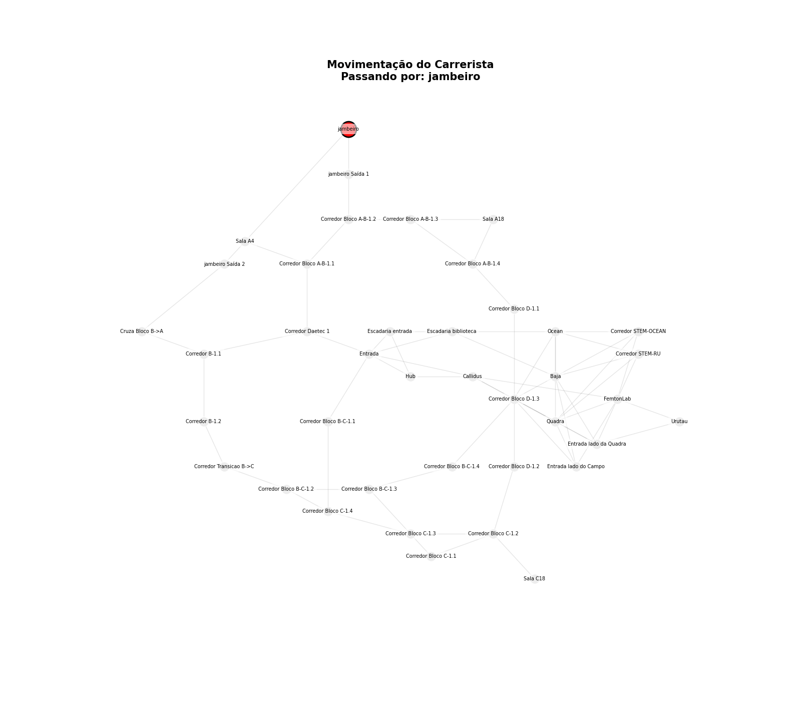
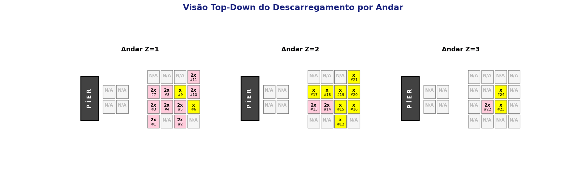
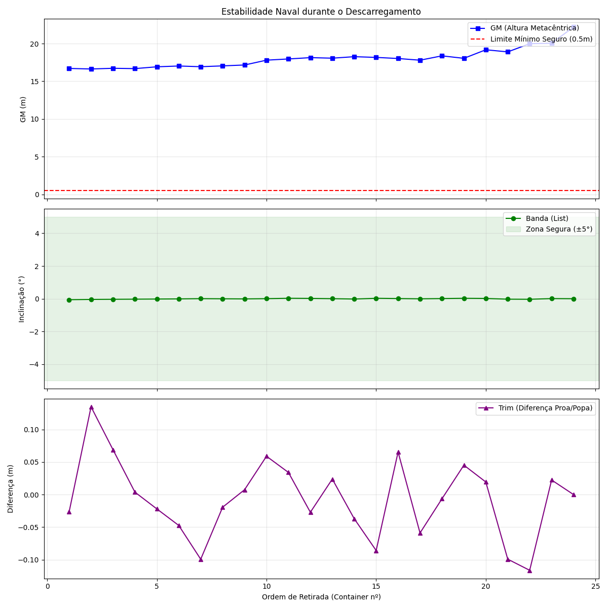
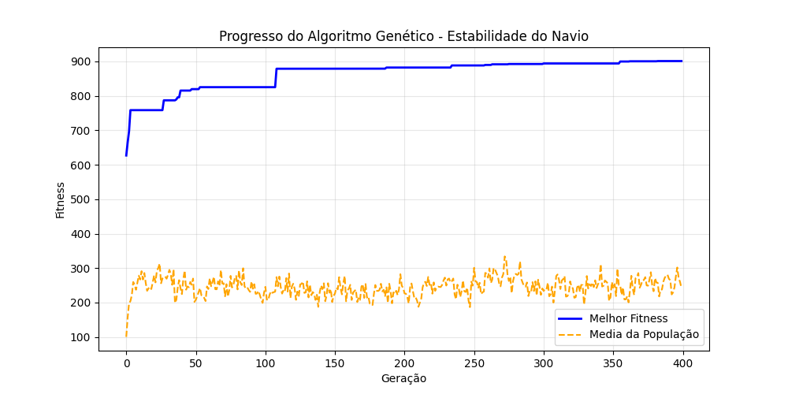
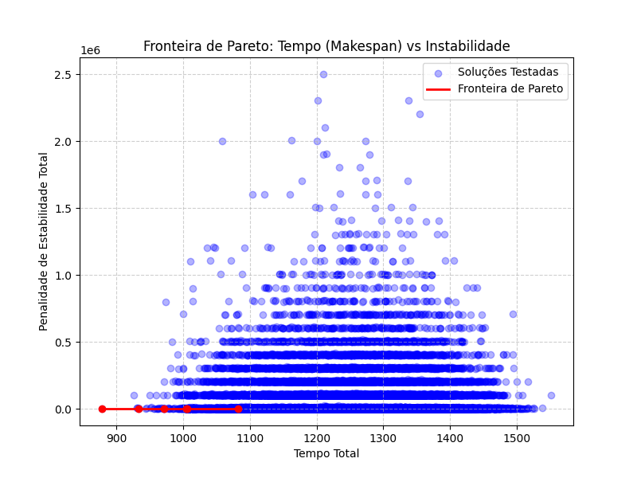

# Argo: Otimização de Descarregamento e Roteamento de Balsa

Este projeto implementa uma solução baseada em **Algoritmos Genéticos (AG)** para resolver o problema logístico de descarregamento de uma balsa, garantindo a estabilidade da embarcação e a eficiência no roteamento das entregas finais no campus.

## 1. Problema Resolvido

**Enunciado:**
Implementar o método de Algoritmos Genéticos para o descarregamento de uma balsa com 24 contêineres:
* **Capacidade da Balsa:** Matriz 4x4 por andar (máximo 11 contêineres por andar).
* **Carga:** 12 contêineres de massa X (Azul) e 12 contêineres de massa 2X (Vermelho). No código, X é definido como 57.0g.
* **Píer:** Limite de 8 contêineres empilhados em uma matriz 2x2x2.
* **Logística de Entrega:**
    * 16 contêineres possuem destinos específicos no campus (EST).
    * Uso de no máximo 2 carretistas simultâneos.
    * Cada carretista pode levar até 2 contêineres por viagem.
* **Objetivos:** Maximizar a estabilidade da balsa a cada retirada e minimizar o *makespan* (tempo total de descarregamento + entregas).

## 2. Equipe de otimização
- [Adriana](https://github.com/RaffaellaSantos)
- [Luana](https://github.com/luanacrdoso)
- [Pedro](https://github.com/phcdleng24-del)
- [Victor](https://github.com/ordozgoite)

## 3. Como o Algoritmo Funciona

O sistema utiliza uma abordagem de **Algoritmo Genético Híbrido**:

1.  **Representação do Indivíduo (Cromossomo):** Cada gene representa uma ação de descarregamento, contendo as coordenadas da garra no barco, as coordenadas de destino no píer e um índice de decisão para a demanda de destino.
2.  **Função de Fitness (Avaliação):**
    * **Estabilidade:** Calcula o centro de massa da balsa a cada retirada. Desvios do centro são penalizados.
    * **Tempo (Makespan):** Simula o tempo total que os carretistas levam para completar as rotas e o guindaste leva para mover os contêineres.
    * **Penalidades:** Movimentos inválidos (tentar pegar onde não há container ou largar em local cheio) recebem altas penalidades no *fitness*.
3.  **Simulação e Roteamento:** O algoritmo integra um gerenciador de porto (`PortManager`) que despacha carretistas em tempo real assim que o píer atinge a capacidade de carga para uma viagem, respeitando a regra de no máximo 2 entregadores ativos.
4.  **Grafo de Rotas:** As distâncias entre os pontos do campus são calculadas usando o algoritmo de Floyd-Warshall sobre um grafo definido com as localizações reais da instituição.

## 4. Como Rodar o Algoritmo

Certifique-se de ter o Python 3.12 ou superior instalado.

### Passo 1: Criar o ambiente virtual (venv)
No terminal, dentro da pasta raiz do projeto:
```bash
python -m venv .venv
```

### Passo 2: Ativar o ambiente virtual
* **Windows:**
    ```bash
    .\.venv\Scripts\activate
    ```
* **Linux/Mac:**
    ```bash
    source .venv/bin/activate
    ```

### Passo 3: Instalar as dependências
```bash
pip install -r requirements.txt
```

### Passo 4: Executar a Main
```bash
python -m app.main
```
O algoritmo iniciará as gerações do AG. Caso a solução falhe em esvaziar o barco na primeira tentativa, ele reiniciará automaticamente usando o melhor indivíduo anterior como semente até obter sucesso.

## 5. Resultados

Ao final da execução bem-sucedida, o console exibirá:
- O log passo a passo de cada movimento do guindaste.
- O tempo de saída de cada carretista e quais contêineres foram levados.
- O **Makespan Total** da operação.
- O número de contêineres restantes no barco (objetivo: 0).

<p align="center">
  <br>
  <em>Figura 1 - Grafo de entrega</em>
</p>

<p align="center">
  <br>
  <em>Figura 2 - Descarregamento</em>
</p>

<p align="center">
  <br>
  <em>Figura 3 - Estabilidade naval final do barco</em>
</p>

<p align="center">
  <br>
  <em>Figura 4 - Evolução dos indivíduos</em>
</p>

<p align="center">
  <br>
  <em>Figura 5 - Fronteira de Pareto</em>
</p>

## 6. Referências

Para conferir as referências e como elas são utilizadas no nosso algoritmo veja o documento [referencias](https://github.com/RaffaellaSantos/AG_Argo/blob/main/referencias_iniciais/referencias.md)
