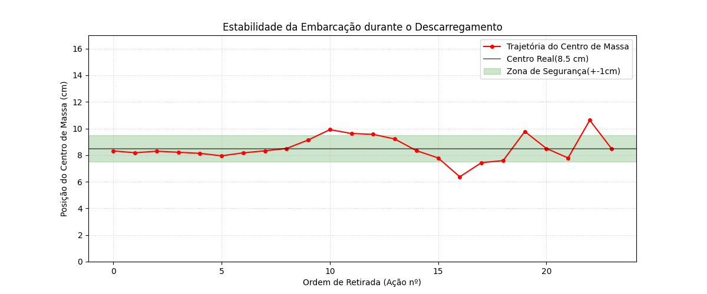
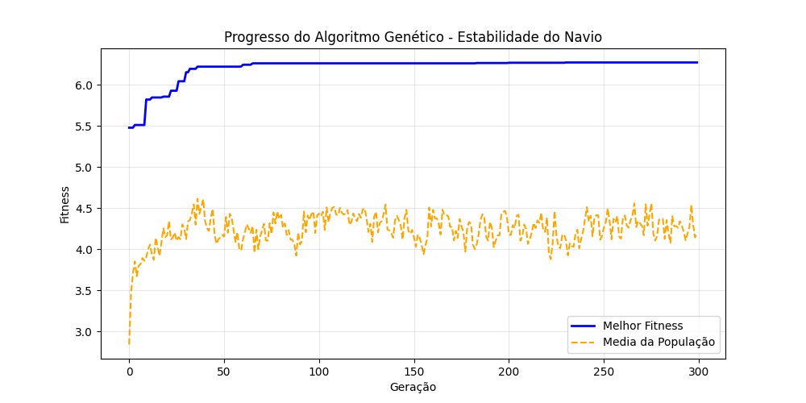
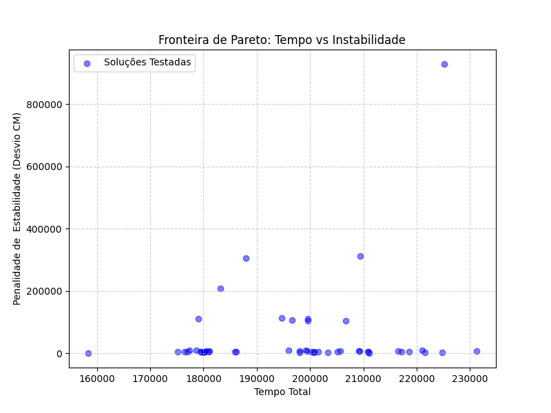

# Resumo das atividades

### Estabilidade no AG

-> Essa parte foi revisada por [Luana](https://github.com/luanacrdoso)

Referência: [Abordagem metaheurística híbrida para otimização do
planejamento de estiva de navios porta-contêineres](https://repositorio.jesuita.org.br/bitstream/handle/UNISINOS/5347/Joel%20da%20Silva%20Gon%C3%A7alves%20J%C3%BAnior_.pdf?isAllowed=y&sequence=1)

No artigo, o AG é utilizado para otimizar o arranjo de carga visando o equilíbrio da embarcação, isso é implementado diretamento na função de avaliação do indivíduo.

- Implementação no Código:
    - Cálculo do Centro de Massa: A função _calcular_estabilidade_ calcula o desvio do centro de massa em relação ao eixo central do braco (CENTRO_BARCO = 8.5)
    - Penalização no AG: O algoritmo aplica uma penalidade proporcional ao desvio. Isso reflete a teoria de que soluções que comprometem a segurança (estabilidade) devem ter um fitness menor para serem descartadas pela seleção natural do AG.

### Restrições de Carregamento e Descarregamento

Referência: [Aplicação de algoritmos genéticos no planejamento de embarque em um terminal de contêineres](https://repositorio.ufu.br/handle/123456789/14378)

O capitulo 4.6 trata da restrição "LIFO" (Last-In, First-Out) ou de empilhamento, onde um container não pode ser retirado se houver outro sobre ele.

- Implementação no Código:
    - Verificação de empilhamento: A função _verificar_container_abaixo_ varre o eixo Z (altura) do topo para baixo.
    - Lógica de Retirada: No simulador de descarregamento, o código busca o pegar_z mais alto disponível em uma coluna. Se houver containers acima, a lógica de busca garante que apenas o topo seja acessível, respeitando a restrição física de movimentação em portos e navios descrita na literatura.

### Rota dos Containers e Movimentação Interna

-> O modelo inicial de roteamento foi feito por [Victor](https://github.com/ordozgoite)
-> Usar o Networkx foi ideia do [Pedro](https://github.com/phcdleng24-del)

Referência: [Algoritmos genéticos aplicados ao problema de roteamento de veículos com múltiplos depósitos](https://repositorio.unifei.edu.br/xmlui/handle/123456789/3920)

- Implementação no Código:

    - Modelagem por Grafos: O algoritmo utiliza a biblioteca networkx para criar um grafo do campus, definindo nós de destino e rotas intermediárias com pesos (distâncias).

    - Matriz de Distâncias: O uso do algoritmo de Floyd-Warshall (nx.floyd_warshall_numpy) para converter o grafo em uma matriz de tempos de viagem é uma técnica clássica de pesquisa operacional mencionada para otimizar trajetos de carreristas (AGVs ou caminhões).

### Integração do Sistema

Referência: [Uma abordagem de resolução integrada para os problemas de roteirização e carregamento de veículos](https://lume.ufrgs.br/handle/10183/25871)

-> A junção do AG de descarregamento e rotas foi feito por [Adriana](https://github.com/RaffaellaSantos)

- Implementação no Código:

    - Sincronização Guindaste-Carrerista: A classe Argo integra o _PortManager_ dentro do loop de descarregamento.

    - Gestão de Filas: O método _despachar_caminhao_ controla quando um carrerista sai do píer com base na capacidade máxima (CAPACIDADE_MAX) e no tempo de prontidão do container (ready_time).

    - Makespan Total: O objetivo final do algoritmo, assim como na dissertação, é minimizar o _makespan_total_, que é o tempo decorrido desde o primeiro movimento do guindaste até a última entrega feita pelos carreristas.

### Resultados visuais do AG

-> Essa parte foi feita por [Luana](https://github.com/luanacrdoso)

   
  <em>Figura 1 - Estabilidade final do barco</em>

   
  <em>Figura 2 - Evolução dos indivíduos</em>

   
  <em>Figura 3 - Fronteira de Pareto</em>

